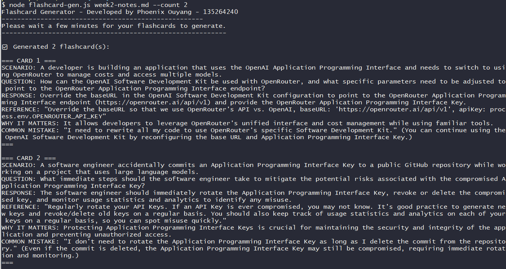

# Flashcard Generator

## Description

This application generates flashcards from text-based notes (HTML, markdown, etc.). It uses an LLM model to read through your notes, and generates 1-5 flashcards in the below format:

```
=== CARD [number] ===
SCENARIO: [1-2 sentence realistic situation where this concept applies]
QUESTION: [Specific question about the scenario - expand all acronyms]
RESPONSE: [Correct answer]
REFERENCE: "[Direct quote from source notes supporting this card]"
WHY IT MATTERS: [1 sentence explaining the broader significance]
COMMON MISTAKE: "[Quote of what a confused student might say]" (Explanation of why this is wrong, with reference to notes)
===
```

It currently utilizes [Google's Gemini 2.0 flash model](https://openrouter.ai/google/gemini-2.0-flash-001), but can be changed to whatever you like! Note that other models may not produce accurate results.

## Installation

1. Download the code to a your local computer and run `npm install`.

1. Add your own notes to the same folder as your project. The notes must be in a text format.

1. Create a `.env` file with a variable `OPENROUTER_API_KEY`, and add your own API key. You can create your own OpenRouter account [here](https://openrouter.ai/)!

1. Update the path variable to where your `.env` file is: `path: path.resolve(__dirname, '<your env filepath here>')`

1. Update the model OpenRouter calls if you'd like:

```javascript
const response = await openai.chat.completions.create({
        model: 'google/gemini-2.0-flash-exp:free', // update this to your desired model
        messages: [
            {
                role: 'system',
                content: prompt
            },
            {
                role: 'user',
                content: stagedChanges
            }
        ],
        temperature: temp,
    });
```

## Usage

In the command line, run `node flashcard-gen.js yournotes.md [--count 3]`. You can update the count to be anywhere between 1-5. The default is 3 flashcards if you exclude this argument.

You will see your outputted flashcards like below:




## Author

Phoenix Ouyang - [Github](https://github.com/phoenixouyang)